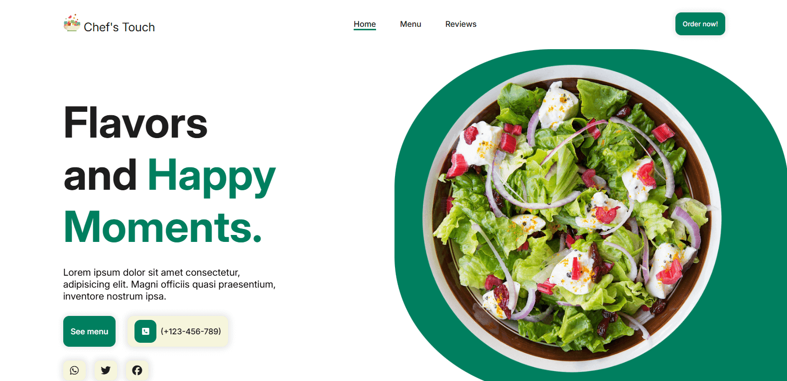
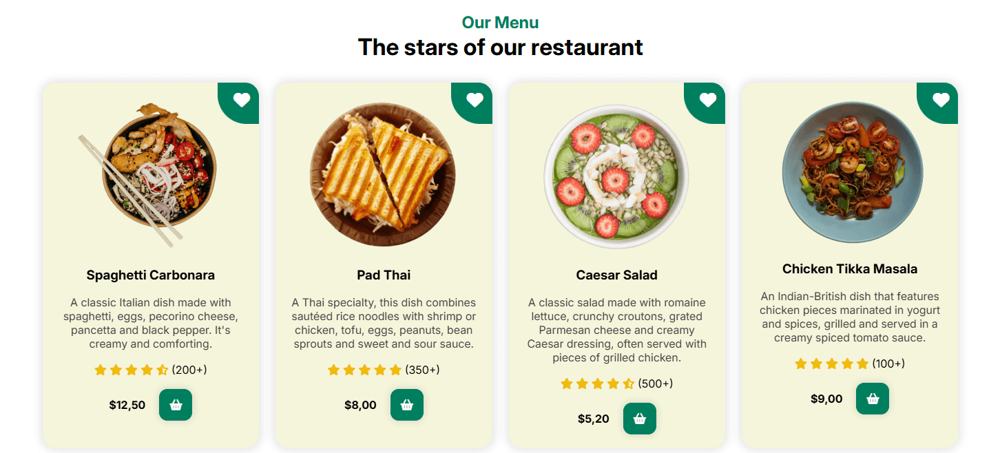

# **👨‍🍳 Restaurant Website**

This project is a modern, **fully responsive** website for a fictional restaurant, showcasing a sleek and inviting design built with **HTML, CSS, and JavaScript**. The site 
incorporates **ScrollReveal** to create engaging **scroll-based animations**, enhancing the user experience with dynamic and interactive elements.

The **responsive layout** adapts effortlessly to various screen sizes, ensuring a consistent and enjoyable browsing experience on desktops, tablets, and smartphones. This 
project allowed me to **practice and refine my UI/UX Design skills**, focusing on creating an intuitive and visually appealing interface. Additionally, I utilized **advanced 
Flexbox** techniques to build a structured and adaptable design that maintains harmony across all devices.

# **🛠️ Main Features**
- **HTML/CSS for structure and styling**
- **JavaScript for interactivity and animations**
- **ScrollReveal for scroll-based animations**
- **Responsive Design using advanced Flexbox techniques**
- **UI/UX Design with a focus on usability and aesthetics**

# **📷 Screenshots**

